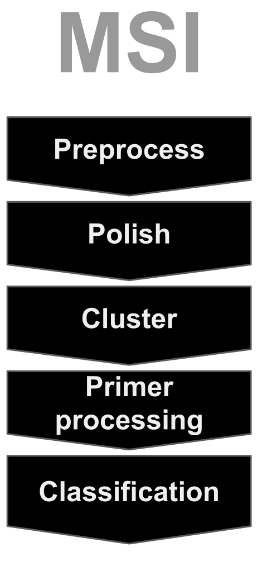
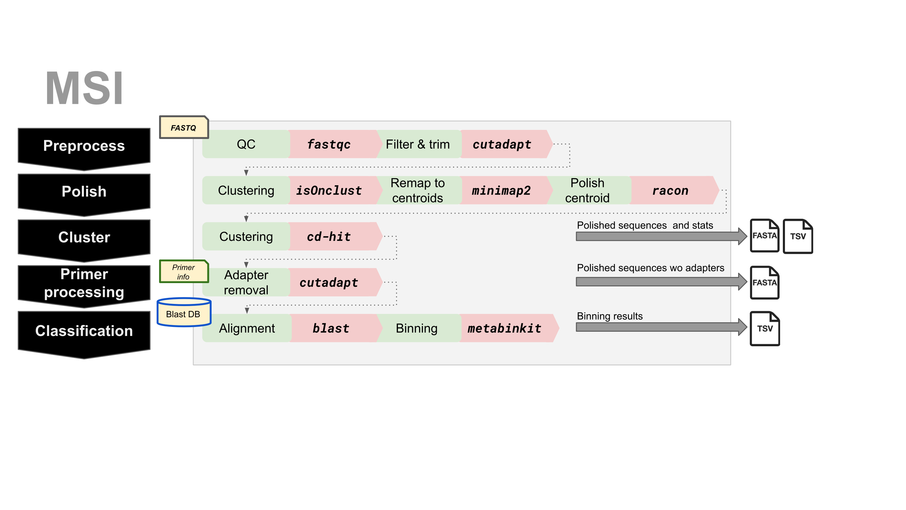

## msi 
 [](http://www.gnu.org/licenses/gpl-3.0.html) [](https://hub.docker.com/r/nunofonseca/msi/tags/) [](https://zenodo.org/badge/latestdoi/191382419) [](https://anaconda.org/bioconda/msi) [](http://bioconda.github.io/recipes/msi/README.html)


1. [Overview](#Overview)
2. [Installation](#Installation)
     1. [Conda](#Conda)
     2. [Docker](#Docker)
     3. [Manual installation](#Manual-Installation)  
3. [Databases](#Databases)
4. [Running MSI](#Running-MSI)
5. [How it works](#How-it-works)


### Overview

 was designed for sequencing reads with higher error rates (e.g., as the ones produced by Nanopore's sequencers) but also works with reads with lower error rates (e.g., Illumina). MSI performs the five operations outlined in the Figure. As input MSI requires FASTQ files (with the reads), and optionally a file with information about the primers (TSV) used and a BLAST database. As output, MSI will produce a fasta file with the centroids of the clusters based on the polished reads (the number of reads in each cluster is kept in the header), and a TSV file with information about each cluster. If a file is provided with primer information, then the adapaters are removed from the polished sequences (a record is kept of which adapter/primer was deleted from each sequence). Finally the polished sequences, after primer removal, are aligned using BLAST against the database provided and the resulting hits binned (associate a taxon to each sequence when possible) and saved to a TSV file.

### Installation


#### Conda  [](http://bioconda.github.io/recipes/msi/README.html)

MSI is available as a conda package in [Bioconda](https://anaconda.org/bioconda). Simply run the following commands to install MSI

     conda install -c bioconda msi
     conda activate base

or you may also try this if you encounter problems with the command above

     conda create -n msi_env -c bioconda -c conda-forge msi
     conda activate msi_env 

#### Docker

A docker file is provided in the top level of MSI ([Dockerfile](https://github.com/nunofonseca/msi/Dockerfile)) that will wrap everything required to run a MSI analysis. This facilitates the setup and installation of MSI, and tracks all software versions used in the analyses. See the [Docker userguide](https://docs.docker.com/) for more details.

Alternatively you may install the software from source following the instructions provided [next](#Installation). A 64 bit computer with an up to date Linux OS installed will be required.

##### Pre-built docker image with MSI

A pre-built image with the latest version of MSI can be dowloaded with the following command:
 
    docker pull nunofonseca/msi:latest

##### Running MSI in a docker container

A companion script to run MSI in a docker container in non-interactive mode is provided here: ([msi_docker](https://github.com/nunofonseca/msi/scripts/msi_docker))

    scripts/msi_docker params_to_msi1  params_to_msi2 ...

It accepts the same arguments as the standalone MSI command (see below) with the caveat that the working directory is a subfolder in the container. All files passed to MSI's docker image need to reside in the or subfolders of directory where `msi_docker` was executed.

See the [Docker userguide](https://docs.docker.com/) for more details on how to run containers in interactive and non-interactive mode.

##### Creating a docker image with MSI

A docker image containing MSI can be created, after [getting the sources](#Getting-sources), by running the following command:

    docker build -f Dockerfile -t msi/latest .


See the [Docker userguide](https://docs.docker.com/) for more details.

#### Manual Installation

##### Supported OS

MSI is developed and tested on multiple distributions of Linux (e.g. Fedora, Ubuntu). Consider the Docker container if you use a non-supported OS or OS version.

##### Getting sources

Option 1: download the latest source release tarball from https://github.com/nunofonseca/msi/releases, and then from your download directory type:

    tar xzf msi-x.x.x.tar.gz
    cd msi-x.x.x

Option 2: to use git to download the repository  with the entire code history, type:

    git clone https://github.com/nunofonseca/msi.git
    cd msi

##### Compile and install

MSI requires several third-party programs in order to work. A script (`scripts/msi_install.sh`) is provided to facilitate the installation of MSI and dependencies. However, some libraries and tools are expected to be installed  (e.g., R 3.6.0 or above, EMBOSS 6.5 or above). A list of system dependencies can be found in MSI's [Dockerfile](https://github.com/nunofonseca/msi/Dockerfile).

To install MSI to a specific folder (e.g., ~/msi) run
    ./scripts/msi_install.sh -i ~/msi

The installation script will download and install third party software used by MSI (e.g., R packages, blast, etc) therefore it will need internet acess and will take several minutes to conclude.


##### Setup

A file msi_env.sh will be created on the toplevel installation folder (~/msi in the above example) with the configuration setup for the shell. To enable the configuration is necessary to load the configuration with the `source` command, e.g., 

    source $HOME/msi_env.sh

The above command needs to be run each time a terminal is opened or be added to the $HOME/.bash_profile file.

### Databases

#### NCBI taxonomy database

MSI requires the NCBI taxonomy database available from ftp://ftp.ncbi.nih.gov/pub/taxonomy/taxdump.tar.gz. By default the `msi_install.sh` script will download the database to `$MSI_DIR/db`, where `MSI_DIR` is the folder where MSI was installed.

#### BLAST database

A BLAST database may be optionally downloaded from NCBI (nt database) to $MSI_DIR/db by running the following command (after having MSI properly installed).

    ./scripts/msi_install.sh -i $MSI_DIR -x blast_db

Alternatively, a BLAST database can be easily created from a FASTA file  using the command `metabinkit_blastgendb` provided by [metabinkit](https://github.com/envmetagen/metabinkit) and installed as part of MSI. By default, the `metabinkit_blastgendb` command expects to find the taxid associated to each sequence in the FASTA file in the respective header. The FASTA header should have the format 

    >sequence_id taxids=xxxxx;
    


### Running MSI

    msi [options] -c params_file.cfg -i raw_data_toplevel_folder -o output_folder

where `raw_data_toplevel_folder` should correspond to the path to the folder where the fastq files (compressed with gzip) may be found. MSI will search for files  with the filename extension .fastq.gz in the top level folder and subfolders.

To get a full list of command line options run

    msi -h

If running MSI in a docker then the command `msi_docker` may be used instead. For instance,

    msi_docker -h

#### Parameters

Parameters may be passed to `msi` (or `msi_docker`) in a text file using the format `parameter=value`. Note that the file may have comments - all characters after a `#` until the end of the line are ignored.

An example of the contents of a file with the parameters for MSI is shown next.

```
TL_DIR="path/to/fastq/files"         # path to the toplevel folder containing the fastq files to be processed
OUT_FOLDER="results"                 # path to the folder where the files produced by MSI will be stored
THREADS=5                            # maximum number of threads
METADATAFILE="samplesheet.tsv"       # metadata about each fastq file
SKIP_BLAST="N"                       # Stop MSI before blast? Yes/No
TAXONOMY_DATA_DIR="$MSI_DIR/db"      # path to the taxonomy database 
CLUSTER_MIN_READS=1                  # minimum number of reads per cluster
CD_HIT_CLUSTER_THRESHOLD=0.99        # cluster/group reads with a similitiry greater than the given threshould (range from 0 to 1)
PRIMER_MAX_ERROR=0.2                 # maximum error accepted when matching a primer sequence to the reads

MIN_LEN=40                           # Reads shorter than MIN_LEN are discarded
MAX_LEN=1000000                      # Reads longer than MAX_LEN are discard
MIN_QUAL=9                           # Minimum phred score

EXPERIMENT_ID=.                      # can be used to filter the entries in the metadata file 
## Parameters from isONclust
# Minmum mapped fraction of read to be included in cluster. 
CLUST_MAPPED_THRESHOLD=0.70
# Minmum aligned fraction of read to be included in cluster. Aligned
# identity depends on the quality of the read. (default: 0.4)
CLUST_ALIGNED_THRESHOLD=0.40


### binning options (passed to metabinkit, check metabinkit manual for details)
#mbk_Species=
#mbk_Genus=
#mbk_Family=
#mabk_AboveF=
#mbk_TopSpecies=
#mbk_TopGenus=
#mbk_TopFamily=
#mbk_TopAF=
#mbk_sp_discard_sp=              
#mbk_sp_discard_mt2w=
#mbk_sp_discard_num=
#mbk_minimal_cols=
#mbk_no_mbk=
#mbk_FilterFile=
#mbk_FilterCol=
#mbk_FamilyBL=
#mbk_GenusBL=
#mbk_SpeciesBL=
#mbk_SpeciesNegFilter=

### blast options (passed to blast, check blast manual for details)
blast_refdb="local_db"            # path to a blast database
#blast_max_hsps= 
#blast_word_size=
#blast_perc_identity=
#blast_qcov_hsp_perc= 
#blast_gapopen= 
#blast_gapextend=
#blast_reward=
#blast_evalue=
#blast_penalty=
#blast_max_target_seqs=
#blast_taxids_blacklist_files=
#blast_taxids_poslist_files=
```

Assuming that the file myexp.cfg contains the above lines, MSI could be started by running

    msi -c myexp.cfg

#### Primer information

The primer information is provided in a metadata file (TSV format) with information for each file to be processed by MSI. The file should contain the columns barcode_name, sample_id, ss_sample_id, primer_set, primer_f, primer_r, min_length, max_length, target_gene where:

- primer_set: unique identifier of the primer
- primer_f:  5'end primer sequence (forward primer)
- primer_r:  3'end reverse complemented primer sequence (reverse primer)
- min_length: minimum length of the fragment
- max_length: maximum length of the fragment
- target_gene: name of the gene targeted
- barcode_name: unique identifier for the file (e.g., library name)

Currently the min_length and max_length are not used by MSI to exclude fragments.


#### Output files

Upon execution, MSI will create a directory set either by the -o OUTPUT_NAME or in the .cfg file with OUT_FOLDER=OUTPUT_NAME. This directory will contain several files and directories

OUTPUT_NAME

| Type    |  File/Dirname   | Description    | 
| --- | --- | --- |
| dirs | fastq_file_prefix* | One folder per input fastq file |
| files | *.versions.txt | Contains the versions of the software used |
| file | results.fasta.gz | fasta file with the clustered/corrected reads|
| file | bin.tsv.gz | Binning table produced by metabinkit (tsv format) |
| file | binres.tsv.gz | tsv file combining the binning results from metabinkit with the results.tsv.gz file |
| file | running.stats.tsv.gz | table containing statistics (nreads,quality_encoding,quality_enc_min,quality_enc_max,read_len_min    read_len_max,read_len_avg) for each fastq and each step of the analyses |

#### Example

Start by generating a blast database by running

    metabinkit_blastgendb -f tests/fasta/test_refdb.fasta -o quick_test/refdb/db1 -c -t 2

A small blast database will be created in the folder `test/refdb/db1`.

In the folder `tests/samples/s4/` there is a fastq file compressed with gzip (`barcode31.fastq.gz`). To process this file run the command:

    msi  -I tests/metadata/metadata2.tsv  -i tests/samples/s4/ -o quick_test/t4 -b quick_test/refdb/db1

The ouput files will be placed in `quick_test/t4`:
 
    $ ls -F quick_test/t4/
    2020-06-02.versions.txt  barcode31/  binres.tsv.gz  bin.tsv.gz  results.fasta.gz  results.tsv.gz  running.stats.tsv.gz


To run the above examples it is assumed that MSI is installed and configured. To use MSI inside a docker is also easy. After downloading MSI:

 1. Get the latest docker image with MSI

        docker pull nunofonseca/msi:latest

 2. Use msi_docker to run the analysis (assumes that MSI's toplevel folder is the current working directory)

        ./scripts/msi_docker  -i tests/samples/s4/ -o quick_test_docker/t4 -b quick_test/refdb/db1


Note that it may need to be necessary to give permission to docker to access your local folder (in order to access the input files and write the output files). This can be done by running the command

    chcon -Rt svirt_sandbox_file_t $PWD

#### How it works



